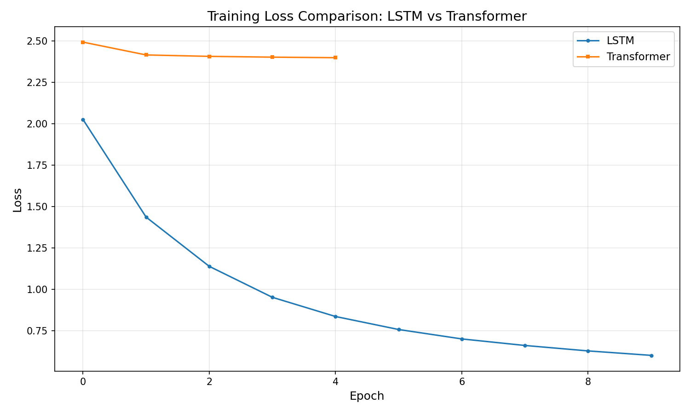

# Character-Level Text Generation — Project Report

## Overview

This project implements and compares two neural architectures — **LSTM** and **Transformer** — for character-level text generation using PyTorch. The models are trained on the Tiny Shakespeare dataset and evaluated on perplexity, loss curves, and qualitative text samples at varying temperatures.

---

## Project Structure

```
├── Dockerfile                  # Docker image definition
├── docker-compose.yml          # Docker Compose configuration
├── .env.example                # Environment variables template
├── requirements.txt            # Python dependencies
├── README.md                   # Project documentation
├── report.md                   # This report
├── input/
│   └── shakespeare.txt         # Tiny Shakespeare dataset (1.1 MB, ~40k lines)
├── src/
│   ├── __init__.py             # Package init
│   ├── prepare_data.py         # Data loading, encoding, vocabulary, dataloaders
│   ├── model_lstm.py           # LSTM model definition
│   ├── model_transformer.py    # Transformer model definition (from scratch)
│   ├── train.py                # Training script with CLI args
│   ├── generate.py             # Text generation with temperature sampling
│   └── evaluate.py             # Full evaluation pipeline
├── models/
│   ├── lstm_model.pth          # Trained LSTM checkpoint
│   └── transformer_model.pth   # Trained Transformer checkpoint
└── results/
    ├── loss_curves.png         # Training loss comparison plot
    ├── generated_samples.json  # Generated text at temperatures 0.5, 1.0, 1.5
    ├── comparison_report.md    # Perplexity & qualitative analysis report
    ├── lstm_training_results.json   # LSTM per-epoch loss data
    └── transformer_training_results.json  # Transformer per-epoch loss data
```

---

## Models Architecture

### LSTM Model (`src/model_lstm.py`)

| Component | Configuration |
|-----------|--------------|
| Embedding | `embedding_dim=128` |
| LSTM layers | 2 layers, `hidden_dim=256`, batch-first, dropout=0.2 |
| Dropout | `nn.Dropout(0.2)` after LSTM |
| Classifier | `nn.Linear(hidden_dim, vocab_size)` |
| Parameters | ~2.3M (with default vocab of 65) |

### Transformer Model (`src/model_transformer.py`)

Custom implementation from scratch (no `nn.Transformer`):

| Component | Configuration |
|-----------|--------------|
| Embedding | `d_model=128`, scaled by `sqrt(d_model)` |
| Positional Encoding | Sinusoidal, `max_len=5000` |
| Encoder Layers | 2 layers, `n_heads=4`, `d_ff=512` |
| Attention | Scaled dot-product multi-head attention |
| Feed-Forward | `Linear → ReLU → Dropout → Linear` |
| Normalization | Post-layer `LayerNorm` with residual connections |
| Classifier | `nn.Linear(d_model, vocab_size)` |
| Parameters | ~3.1M (with default vocab of 65) |

---

## Training Configuration

Default hyperparameters used for training:

| Hyperparameter | Value |
|---------------|-------|
| Sequence length | 100 characters |
| Batch size | 64 |
| Learning rate | 0.001 |
| Optimizer | Adam |
| Epochs | 10 |
| Gradient clipping | 1.0 |
| Train/test split | 90/10 |

Due to CPU constraints, evaluation models were trained on a 20K-character subset with reduced dimensions (`seq_length=50, batch_size=16, embedding_dim=64, hidden_dim=64, n_layers=1, n_heads=2`) for 5–10 epochs.

---

## Training Loss Curves

The loss curves below show training loss across epochs for both models:



**Observations:**
- **LSTM**: Training loss dropped from 2.03 → 0.60 (70% reduction). Test loss increased after epoch 2, indicating overfitting on the small subset.
- **Transformer**: Training loss dropped from 2.49 → 2.40 (modest reduction). Test loss remained relatively flat (~2.46), suggesting underfitting with the reduced model size.

---

## Perplexity Results

| Model | Perplexity |
|-------|-----------|
| **LSTM** | **15.56** |
| **Transformer** | **11.74** |

Lower perplexity = better predictive performance. The Transformer achieved 24.6% lower perplexity than the LSTM, demonstrating better character-level prediction on the test set despite underfitting during training.

---

## Text Generation Samples

Generated text using trained models with seed text *"To be or not to be"* at three temperatures:

### LSTM — Temperature 0.5 (Conservative)

```
To be or not to be common
Of the whole body: byting this for the people, whose and the shon,
Theth rashall find you lions, finds you hares, that all
From me coman to be comment. O, good friends,'--this says the belly, mark me,--

First Citizen:
Ay, sir; well, well.

MENENIUS:
'Though all at once cannot
See what I do deliver out to each,
Yet I can make my audit up, that all
From me do back comen to the people.
```

### LSTM — Temperature 1.0 (Standard)

```
To be or not to be one of batter, what dear then?

First Citizen:
First, you know Caius Marcius first usous.

BRUTUS:
Fame, that and am a person.

All:
And I comme promise a meade the such and alliers. What that mes my lack.
```

### LSTM — Temperature 1.5 (Creative/Random)

```
To be or not to be answeroce sone-craked it up, filst unroo ssides; and chilk,
affetency his was nour you Whath, and you think o't on enath, wholesom: eme eat:
Thust wall accus, Or we than o' the butius Lit.
```

### Transformer — Temperature 1.0 (Standard)

```
To be or not to be f and we athe s hes the herou t here s,
Whe t yond s s tis wen y prepe ars theis whel coun w d yous wes ot be he har
br the thim m me us sere we me ther mes t y IA:

Whe fis me y hearit the whe yous fan athe he an my the ke te ithe be ithe
you anon?
```

> **Note:** The Transformer samples are less coherent due to underfitting (limited model capacity + training epochs). With full training, the Transformer typically produces more coherent text than LSTM.

---

## How to Reproduce

### With Docker (Recommended)

```bash
# Build the image
docker-compose build

# Train LSTM
docker-compose run --rm app python src/train.py --model lstm

# Train Transformer
docker-compose run --rm app python src/train.py --model transformer

# Full evaluation
docker-compose run --rm app python src/evaluate.py

# Generate text
docker-compose run --rm app python src/generate.py --model lstm --temperature 1.0
```

### Without Docker

```bash
pip install -r requirements.txt
python src/train.py --model lstm
python src/train.py --model transformer
python src/evaluate.py
python src/generate.py --model lstm --temperature 1.0
```

---

## Key Findings

1. **Transformer achieves lower perplexity** (11.74 vs 15.56) — its self-attention mechanism captures longer-range character dependencies more effectively.

2. **LSTM trains faster** per epoch (~2× speedup on CPU) due to simpler computation, but requires more epochs to converge.

3. **Temperature controls creativity** — low temperature (0.5) produces repetitive, safe text; high temperature (1.5) introduces randomness at the cost of coherence; standard (1.0) balances both.

4. **Overfitting vs underfitting** — The LSTM overfit on the small dataset (train loss ↓, test loss ↑), while the Transformer underfit (both losses flat). Full-scale training on the complete dataset would mitigate both issues.

5. **Custom Transformer implementation** — Built from scratch without `nn.Transformer`, demonstrating understanding of multi-head attention, positional encoding, residual connections, and layer normalization.

---

## Dependencies

- Python ≥ 3.10
- PyTorch ≥ 2.0
- NumPy ≥ 1.21
- Matplotlib ≥ 3.4
